# Intelligent Invigilation Management System — Class Diagram

## Class Diagram

```mermaid
classDiagram

    %% ─── Auth Layer ───────────────────────────────────────────
    class AuthStore {
        -Session session
        -User user
        -string role
        +login(email, password) Promise~Session~
        +logout() void
        +getSession() Session
        +isAdmin() boolean
        +isInstructor() boolean
    }

    class User {
        +string id
        +string email
        +string full_name
        +UserRole role
        +string instructor_id
        +Date created_at
    }

    class UserRole {
        <<enumeration>>
        ADMIN
        INSTRUCTOR
    }

    %% ─── Domain Models ────────────────────────────────────────
    class Instructor {
        +string id
        +string full_name
        +string email
        +string department
        +string employee_code
        +int total_duties
        +int on_time_count
        +int late_count
        +float punctuality_rate
        +Date created_at
        +Date updated_at
    }

    class Exam {
        +string id
        +string title
        +string course_code
        +string department
        +Date exam_date
        +string start_time
        +string end_time
        +string reporting_time
        +int duration_minutes
        +Date created_at
    }

    class Room {
        +string id
        +string room_number
        +string building
        +int capacity
        +string floor
        +boolean is_active
        +Date created_at
    }

    class Duty {
        +string id
        +string exam_id
        +string room_id
        +string instructor_id
        +string assigned_by
        +DutyStatus status
        +Date arrival_time
        +PunctualityStatus punctuality_status
        +string notes
        +Date created_at
        +Date updated_at
    }

    class DutyStatus {
        <<enumeration>>
        PENDING
        CONFIRMED
        COMPLETED
        ABSENT
    }

    class PunctualityStatus {
        <<enumeration>>
        PENDING
        ON_TIME
        LATE
        ABSENT
    }

    class AnalyticsCache {
        +string id
        +string instructor_id
        +int total_duties
        +int on_time_count
        +int late_count
        +float punctuality_rate
        +float duty_variance
        +WorkloadStatus workload_status
        +Date last_updated
    }

    class WorkloadStatus {
        <<enumeration>>
        OVERLOADED
        BALANCED
        UNDERUTILIZED
    }

    class AuditLog {
        +string id
        +string actor_id
        +AuditAction action
        +string entity_type
        +string entity_id
        +object before_state
        +object after_state
        +Date created_at
    }

    class AuditAction {
        <<enumeration>>
        CREATE
        UPDATE
        DELETE
    }

    %% ─── Custom Hooks (Data Layer) ────────────────────────────
    class useDuties {
        -Duty[] duties
        -boolean loading
        -string error
        +fetchDuties(filters) Promise~Duty[]~
        +createDuty(data) Promise~Duty~
        +updateDuty(id, data) Promise~Duty~
        +deleteDuty(id) Promise~void~
        +markArrival(dutyId) Promise~Duty~
        +subscribeToChanges(callback) void
    }

    class useInstructors {
        -Instructor[] instructors
        -boolean loading
        +fetchInstructors() Promise~Instructor[]~
        +fetchInstructorsWithStats() Promise~Instructor[]~
        +createInstructor(data) Promise~Instructor~
        +updateInstructor(id, data) Promise~Instructor~
        +deleteInstructor(id) Promise~void~
    }

    class useExamsRooms {
        -Exam[] exams
        -Room[] rooms
        -boolean loading
        +fetchExams() Promise~Exam[]~
        +createExam(data) Promise~Exam~
        +updateExam(id, data) Promise~Exam~
        +deleteExam(id) Promise~void~
        +fetchRooms() Promise~Room[]~
        +createRoom(data) Promise~Room~
        +updateRoom(id, data) Promise~Room~
        +deleteRoom(id) Promise~void~
    }

    %% ─── Utility Classes (Business Logic) ────────────────────
    class PunctualityUtil {
        <<utility>>
        +BUFFER_MINUTES: int = 30$
        +detectPunctuality(arrivalTime, reportingTime) PunctualityStatus$
        +computeDeadline(reportingTime) Date$
        +isLate(arrivalTime, reportingTime) boolean$
        +formatPunctualityRate(rate) string$
    }

    class WorkloadUtil {
        <<utility>>
        +OVERLOAD_THRESHOLD: float = 1.2$
        +UNDERUTILIZE_THRESHOLD: float = 0.8$
        +computeAverage(instructors) float$
        +computeVariance(duties, average) float$
        +getWorkloadStatus(duties, average) WorkloadStatus$
        +getSuggestedInstructor(instructors) Instructor$
        +computeWorkloadForAll(instructors) Instructor[]$
    }

    %% ─── Supabase Client ──────────────────────────────────────
    class SupabaseClient {
        <<service>>
        -string url
        -string anonKey
        +from(table) QueryBuilder
        +auth: SupabaseAuth
        +channel(name) RealtimeChannel
        +rpc(fn, params) Promise~any~
    }

    %% ─── Pages (UI Layer) ─────────────────────────────────────
    class InstructorDashboard {
        -Duty[] upcomingDuties
        -Duty[] pastDuties
        +render() JSX
        +groupDutiesByDate(duties) Map
        +handleMarkArrival(dutyId) void
    }

    class AdminDashboard {
        -Instructor[] instructors
        -Duty[] recentDuties
        -ChartData distributionData
        +render() JSX
        +loadAnalytics() void
        +handleRealtimeUpdate(payload) void
    }

    class InstructorProfile {
        -Instructor profile
        -AnalyticsCache stats
        +render() JSX
        +loadProfile() void
    }

    %% ─── Shared Components ────────────────────────────────────
    class DutyCard {
        +Duty duty
        +boolean canMarkArrival
        +onMarkArrival() void
        +render() JSX
    }

    class DutyDistributionChart {
        +Instructor[] instructors
        +render() JSX
        +buildChartData(instructors) ChartData
    }

    class StatusBadge {
        +string status
        +string type
        +render() JSX
    }

    %% ─── Relationships ────────────────────────────────────────

    %% Auth
    AuthStore --> User : manages
    AuthStore --> SupabaseClient : uses
    User --> UserRole : has

    %% Domain model associations
    Duty --> DutyStatus : has
    Duty --> PunctualityStatus : has
    Duty --> Instructor : assigned to
    Duty --> Exam : for
    Duty --> Room : in
    AnalyticsCache --> Instructor : caches stats for
    AnalyticsCache --> WorkloadStatus : categorizes
    AuditLog --> AuditAction : records

    %% Hooks use Supabase
    useDuties --> SupabaseClient : queries
    useInstructors --> SupabaseClient : queries
    useExamsRooms --> SupabaseClient : queries

    %% Hooks use utilities
    useDuties --> PunctualityUtil : calls on markArrival
    useInstructors --> WorkloadUtil : calls on fetch

    %% Pages use hooks
    InstructorDashboard --> useDuties : uses
    AdminDashboard --> useInstructors : uses
    AdminDashboard --> useDuties : uses
    InstructorProfile --> useInstructors : uses

    %% Pages use components
    InstructorDashboard --> DutyCard : renders
    AdminDashboard --> DutyDistributionChart : renders
    AdminDashboard --> StatusBadge : renders
    DutyCard --> StatusBadge : renders
```



---

## Layer Architecture

The IIMS codebase is organized into four distinct layers, each with a single responsibility:

```
┌─────────────────────────────────────────────────────┐
│                   UI Layer (Pages)                   │
│   InstructorDashboard │ AdminDashboard │ Profile     │
├─────────────────────────────────────────────────────┤
│               Component Layer (Shared)               │
│       DutyCard │ DutyDistributionChart │ StatusBadge │
├─────────────────────────────────────────────────────┤
│           Data Layer (Custom Hooks)                  │
│      useDuties │ useInstructors │ useExamsRooms      │
├─────────────────────────────────────────────────────┤
│          Business Logic Layer (Utils)                │
│         PunctualityUtil │ WorkloadUtil               │
├─────────────────────────────────────────────────────┤
│            Infrastructure Layer                      │
│    SupabaseClient │ AuthStore (Zustand) │ RLS        │
└─────────────────────────────────────────────────────┘
```

---

## Class Descriptions

### AuthStore
Global auth state manager built with Zustand. Holds the current session, user profile, and role. All components access role and identity through this store rather than making direct Supabase auth calls.

### PunctualityUtil
Pure utility class containing all punctuality detection logic. Stateless and fully testable in isolation. Core method `detectPunctuality()` compares instructor arrival time against the deadline (reporting time minus the 30-minute buffer) and returns a `PunctualityStatus` enum value.

```
deadline = reporting_time - 30 min
status   = arrivalTime ≤ deadline ? ON_TIME : LATE
```

### WorkloadUtil
Pure utility class implementing the Workload Intelligence Engine. Stateless and fully testable. Computes average duty load across all instructors, calculates individual variance, and assigns a `WorkloadStatus` label. The `getSuggestedInstructor()` method returns the instructor with the lowest current duty count, driving the admin auto-suggestion feature.

```
average          = totalDuties / instructorCount
overloaded       = duties > average × 1.2
underutilized    = duties < average × 0.8
balanced         = otherwise
```

### useDuties
Custom React hook that abstracts all duty-related Supabase interactions. Manages local state for the duties list, loading flag, and errors. Calls `PunctualityUtil.detectPunctuality()` inside `markArrival()` before persisting the result. Also manages the Realtime subscription for live duty updates on the admin dashboard.

### useInstructors
Custom React hook for all instructor data operations. After fetching instructor stats, it delegates to `WorkloadUtil.computeWorkloadForAll()` to annotate each instructor with their current workload status and variance before returning data to the UI.

### useExamsRooms
Custom React hook handling exam and room CRUD operations. Provides both lists to the duty creation form.

### DutyCard
Instructor-facing component representing a single duty. Displays exam name, room, date, reporting time, and punctuality badge. Conditionally shows the "Mark Arrival" button only if the duty is in `PENDING` status and today is the exam date.

### DutyDistributionChart
Admin-facing component rendering a bar chart of duty counts per instructor using Recharts. Color-codes bars by workload status: red for overloaded, green for balanced, yellow for underutilized.

---

## Key Design Principles Applied

| Principle | Application |
|---|---|
| **Single Responsibility** | Each hook handles one entity type. Utility classes contain only pure logic with no UI or data-fetching concerns. |
| **Separation of Concerns** | Business rules (punctuality, workload) are fully isolated in `utils/`. Hooks handle data. Pages handle rendering. |
| **Open/Closed** | New workload thresholds or punctuality rules can be added to utility classes without touching hooks or UI. |
| **DRY** | `PunctualityUtil` and `WorkloadUtil` are called from hooks — never duplicated across components. |
| **Dependency Inversion** | Pages depend on hooks (abstractions), not directly on SupabaseClient (implementation). |