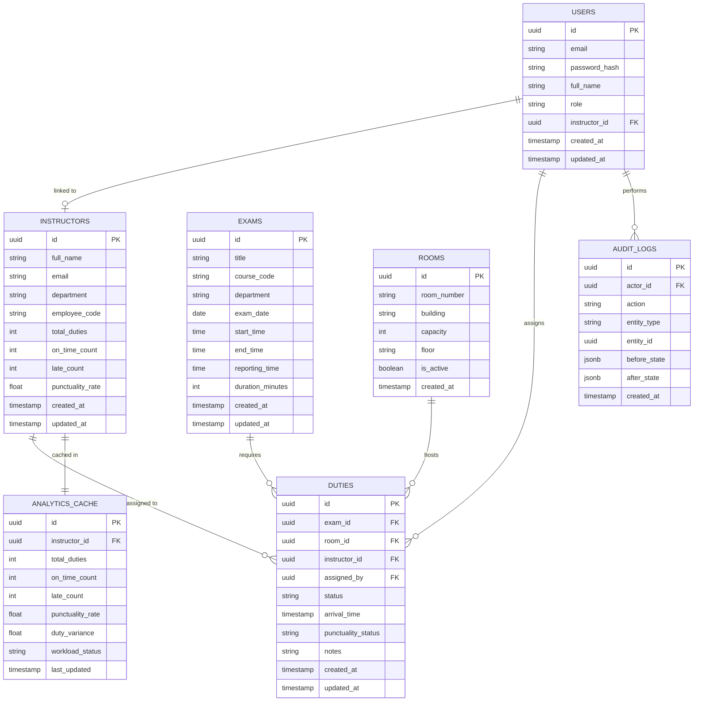

# Intelligent Invigilation Management System — ER Diagram

## Entity Relationship Diagram

---

## Entity Descriptions

### USERS
Represents all authenticated accounts in the system. A user has a role of either `admin` or `instructor`. Instructor-role users are linked to an `INSTRUCTORS` record via `instructor_id`. Admin users have no instructor linkage.

| Field | Type | Description |
|---|---|---|
| id | UUID (PK) | Unique user identifier |
| email | STRING | Login email, unique |
| password_hash | STRING | bcrypt-hashed password |
| full_name | STRING | Display name |
| role | ENUM | `admin` or `instructor` |
| instructor_id | UUID (FK) | Links to INSTRUCTORS if role = instructor |
| created_at | TIMESTAMP | Account creation time |
| updated_at | TIMESTAMP | Last profile update |

---

### INSTRUCTORS
Stores instructor profiles and aggregated performance statistics. This is the core entity around which duty assignment and workload balancing operates.

| Field | Type | Description |
|---|---|---|
| id | UUID (PK) | Unique instructor identifier |
| full_name | STRING | Instructor's full name |
| email | STRING | Institutional email |
| department | STRING | Academic department |
| employee_code | STRING | Unique institutional code |
| total_duties | INT | Total duties assigned |
| on_time_count | INT | Count of on-time arrivals |
| late_count | INT | Count of late arrivals |
| punctuality_rate | FLOAT | Percentage of on-time arrivals |
| created_at | TIMESTAMP | Profile creation time |
| updated_at | TIMESTAMP | Last update time |

---

### EXAMS
Defines individual exam events. Each exam has a specific reporting time — used by the punctuality detection engine (arrivals must be logged ≥ 30 minutes before reporting time).

| Field | Type | Description |
|---|---|---|
| id | UUID (PK) | Unique exam identifier |
| title | STRING | Exam name |
| course_code | STRING | Associated course code |
| department | STRING | Organizing department |
| exam_date | DATE | Date of examination |
| start_time | TIME | Exam start time |
| end_time | TIME | Exam end time |
| reporting_time | TIME | Time invigilators must report by |
| duration_minutes | INT | Total exam duration |
| created_at | TIMESTAMP | Record creation time |
| updated_at | TIMESTAMP | Last update time |

---

### ROOMS
Represents physical examination venues. Each duty is tied to a specific room, allowing room-level scheduling and conflict detection.

| Field | Type | Description |
|---|---|---|
| id | UUID (PK) | Unique room identifier |
| room_number | STRING | Room/hall number |
| building | STRING | Building name |
| capacity | INT | Seating capacity |
| floor | STRING | Floor level |
| is_active | BOOLEAN | Whether room is available for use |
| created_at | TIMESTAMP | Record creation time |

---

### DUTIES
The central junction entity linking exams, rooms, and instructors. Each duty record represents one instructor assigned to one exam in one room. Arrival time and punctuality status are recorded here when the instructor marks their arrival.

| Field | Type | Description |
|---|---|---|
| id | UUID (PK) | Unique duty identifier |
| exam_id | UUID (FK) | References EXAMS |
| room_id | UUID (FK) | References ROOMS |
| instructor_id | UUID (FK) | References INSTRUCTORS |
| assigned_by | UUID (FK) | References USERS (admin who assigned) |
| status | ENUM | `pending`, `confirmed`, `completed`, `absent` |
| arrival_time | TIMESTAMP | When instructor marked arrival |
| punctuality_status | ENUM | `on_time`, `late`, `absent`, `pending` |
| notes | STRING | Optional admin notes |
| created_at | TIMESTAMP | Assignment creation time |
| updated_at | TIMESTAMP | Last status update |

---

### ANALYTICS_CACHE
Caches computed workload and punctuality statistics per instructor. Automatically updated via database trigger on every DUTIES mutation. Drives the admin analytics dashboard and workload intelligence engine without re-aggregating on every page load.

| Field | Type | Description |
|---|---|---|
| id | UUID (PK) | Cache record identifier |
| instructor_id | UUID (FK) | References INSTRUCTORS |
| total_duties | INT | Total duties at time of cache |
| on_time_count | INT | On-time arrivals |
| late_count | INT | Late arrivals |
| punctuality_rate | FLOAT | Computed punctuality percentage |
| duty_variance | FLOAT | Deviation from org-wide average |
| workload_status | ENUM | `overloaded`, `balanced`, `underutilized` |
| last_updated | TIMESTAMP | When cache was last refreshed |

---

### AUDIT_LOGS
Tamper-proof log of all data mutations performed by admin users. Records the actor, the action type, the affected entity, and a before/after snapshot of the data. Used for compliance and accountability tracking.

| Field | Type | Description |
|---|---|---|
| id | UUID (PK) | Log entry identifier |
| actor_id | UUID (FK) | References USERS (who performed action) |
| action | ENUM | `CREATE`, `UPDATE`, `DELETE` |
| entity_type | STRING | Table name (e.g., `duties`, `instructors`) |
| entity_id | UUID | ID of the affected record |
| before_state | JSONB | Snapshot before the change |
| after_state | JSONB | Snapshot after the change |
| created_at | TIMESTAMP | When the action occurred |

---

## Relationships Summary

| Relationship | Type | Description |
|---|---|---|
| USERS → INSTRUCTORS | One-to-One (optional) | Instructor-role users are linked to one instructor profile |
| INSTRUCTORS → DUTIES | One-to-Many | An instructor can be assigned to many duties |
| EXAMS → DUTIES | One-to-Many | An exam can have multiple duty assignments (multiple rooms) |
| ROOMS → DUTIES | One-to-Many | A room can host duties across multiple exams |
| USERS → DUTIES | One-to-Many | An admin user can assign many duties |
| INSTRUCTORS → ANALYTICS_CACHE | One-to-One | Each instructor has one cached analytics record |
| USERS → AUDIT_LOGS | One-to-Many | A user can generate many audit log entries |

---

## Key Design Decisions

- **Duties as junction table** — DUTIES is the heart of the schema, linking three entities (exam, room, instructor) while also holding operational state (arrival time, punctuality status).
- **Denormalized stats on INSTRUCTORS** — `total_duties`, `on_time_count`, and `late_count` are stored directly on the INSTRUCTORS table for fast profile queries, and kept in sync via triggers.
- **ANALYTICS_CACHE separation** — Workload intelligence metrics (variance, workload status) are isolated in a dedicated cache table, updated by trigger, so the admin dashboard never blocks on expensive aggregation queries.
- **JSONB for audit snapshots** — Before/after states stored as JSONB allow the audit log to capture any entity without schema changes.
- **RLS enforcement** — Row Level Security policies use the `role` field in USERS to gate access: instructors can only SELECT/UPDATE their own DUTIES rows; admins have unrestricted access.
