# Intelligent Invigilation Management System — Use Case Diagram

## Use Case Diagram

```mermaid
graph TB
    %% Actors
    Instructor(["👤 Instructor"])
    Admin(["👤 Administrator"])
    System(["⚙️ System"])

    %% System Boundary
    subgraph IIMS ["Intelligent Invigilation Management System"]

        %% Auth
        UC1["Login"]
        UC2["Logout"]

        %% Instructor Use Cases
        UC3["View Personal Dashboard"]
        UC4["View Upcoming Duties"]
        UC5["View Past Duties"]
        UC6["Mark Arrival"]
        UC7["View Punctuality Status"]
        UC8["View Personal Profile & Stats"]

        %% Admin — Duty Management
        UC9["View Admin Dashboard"]
        UC10["Create Duty Assignment"]
        UC11["Edit Duty Assignment"]
        UC12["Delete Duty Assignment"]
        UC13["View All Duties"]

        %% Admin — Instructor Management
        UC14["Create Instructor Profile"]
        UC15["Edit Instructor Profile"]
        UC16["Delete Instructor Profile"]
        UC17["View All Instructors"]

        %% Admin — Exam & Room Management
        UC18["Create Exam"]
        UC19["Edit Exam"]
        UC20["Delete Exam"]
        UC21["Create Room"]
        UC22["Edit Room"]
        UC23["Delete Room"]

        %% Admin — Intelligence & Analytics
        UC24["View Workload Distribution"]
        UC25["Get Auto-Suggested Instructor"]
        UC26["View Punctuality Analytics"]
        UC27["Flag Overloaded Instructors"]
        UC28["Flag Underutilized Instructors"]

        %% System Automated Use Cases
        UC29["Detect Punctuality Status"]
        UC30["Compute Workload Balance"]
        UC31["Update Analytics Cache"]
        UC32["Enforce Row Level Security"]

    end

    %% Instructor associations
    Instructor --- UC1
    Instructor --- UC2
    Instructor --- UC3
    Instructor --- UC4
    Instructor --- UC5
    Instructor --- UC6
    Instructor --- UC7
    Instructor --- UC8

    %% Admin associations
    Admin --- UC1
    Admin --- UC2
    Admin --- UC9
    Admin --- UC10
    Admin --- UC11
    Admin --- UC12
    Admin --- UC13
    Admin --- UC14
    Admin --- UC15
    Admin --- UC16
    Admin --- UC17
    Admin --- UC18
    Admin --- UC19
    Admin --- UC20
    Admin --- UC21
    Admin --- UC22
    Admin --- UC23
    Admin --- UC24
    Admin --- UC25
    Admin --- UC26

    %% System automated associations
    System --- UC29
    System --- UC30
    System --- UC31
    System --- UC32

    %% Include relationships
    UC6 -.->|"«include»"| UC29
    UC10 -.->|"«include»"| UC25
    UC10 -.->|"«include»"| UC31
    UC11 -.->|"«include»"| UC31
    UC12 -.->|"«include»"| UC31
    UC24 -.->|"«include»"| UC30
    UC24 -.->|"«include»"| UC27
    UC24 -.->|"«include»"| UC28

    %% Styling
    style IIMS fill:#f0fdf4,stroke:#16a34a,stroke-width:2px
    style Instructor fill:#dbeafe,stroke:#2563eb,stroke-width:2px
    style Admin fill:#fef3c7,stroke:#d97706,stroke-width:2px
    style System fill:#f3e8ff,stroke:#7c3aed,stroke-width:2px
```

---

## Actor Descriptions

### 👤 Instructor
A faculty member assigned to exam invigilation duties. Interacts with the system to view their schedule, mark arrival on duty day, and monitor their personal punctuality record. Has read-only access to their own data only — cannot view or modify other instructors' duties.

### 👤 Administrator
An institutional staff member with full system access. Manages the complete lifecycle of duties, exams, rooms, and instructor profiles. Uses the Workload Intelligence Engine to make fair assignment decisions and monitors system-wide punctuality and distribution analytics.

### ⚙️ System
Automated background processes triggered by user actions or scheduled events. Responsible for punctuality detection (evaluating arrival times against the 30-minute buffer rule), computing workload balance across instructors, updating the analytics cache after every duty mutation, and enforcing Row Level Security policies at the database layer.

---

## Use Case Descriptions

### Authentication

| Use Case | Actor | Description |
|---|---|---|
| Login | Instructor, Admin | Authenticate via email and password. JWT token issued with role metadata embedded. |
| Logout | Instructor, Admin | Invalidate session and clear auth token. |

### Instructor Use Cases

| Use Case | Actor | Description |
|---|---|---|
| View Personal Dashboard | Instructor | See upcoming and past duties grouped by date. |
| View Upcoming Duties | Instructor | List all future assigned duties with exam and room details. |
| View Past Duties | Instructor | Browse completed duties with punctuality outcomes. |
| Mark Arrival | Instructor | One-click arrival registration. Triggers System: Detect Punctuality Status. |
| View Punctuality Status | Instructor | See on-time / late status per duty after marking arrival. |
| View Personal Profile & Stats | Instructor | View total duties, on-time count, late count, and punctuality rate. |

### Admin — Duty Management

| Use Case | Actor | Description |
|---|---|---|
| View Admin Dashboard | Admin | Real-time overview of duties, workload distribution, and punctuality trends. |
| Create Duty Assignment | Admin | Assign an instructor to an exam in a specific room. Triggers auto-suggestion and cache update. |
| Edit Duty Assignment | Admin | Modify exam, room, or instructor linkage. Triggers cache update. |
| Delete Duty Assignment | Admin | Remove a duty. Triggers cache update. |
| View All Duties | Admin | Browse all duties across all instructors with filtering and search. |

### Admin — Instructor Management

| Use Case | Actor | Description |
|---|---|---|
| Create Instructor Profile | Admin | Add a new instructor with department and contact details. |
| Edit Instructor Profile | Admin | Update instructor information. |
| Delete Instructor Profile | Admin | Remove instructor and associated records. |
| View All Instructors | Admin | Browse all instructor profiles with workload indicators. |

### Admin — Exam & Room Management

| Use Case | Actor | Description |
|---|---|---|
| Create / Edit / Delete Exam | Admin | Full lifecycle management of exam definitions including reporting time. |
| Create / Edit / Delete Room | Admin | Full lifecycle management of examination venues. |

### Admin — Intelligence & Analytics

| Use Case | Actor | Description |
|---|---|---|
| View Workload Distribution | Admin | Visual chart of duty count per instructor. Flags imbalances automatically. |
| Get Auto-Suggested Instructor | Admin | When creating a duty, system surfaces the least-loaded eligible instructor. |
| View Punctuality Analytics | Admin | Dashboard of on-time vs late rates across all instructors. |
| Flag Overloaded Instructors | Admin | Highlights instructors with duties > 120% of average. |
| Flag Underutilized Instructors | Admin | Highlights instructors with duties < 80% of average. |

### System Automated Use Cases

| Use Case | Trigger | Description |
|---|---|---|
| Detect Punctuality Status | Mark Arrival | Compares arrival timestamp against exam reporting time minus 30 minutes. Sets status to `on_time` or `late`. |
| Compute Workload Balance | View Dashboard / Create Duty | Calculates average duties per instructor. Computes variance and sets workload status per instructor. |
| Update Analytics Cache | Any DUTIES mutation | Database trigger refreshes `ANALYTICS_CACHE` for affected instructor. Keeps dashboard metrics current. |
| Enforce Row Level Security | Every DB query | Supabase RLS policies restrict instructors to their own rows. Admins bypass restrictions. |